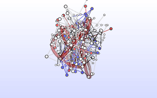
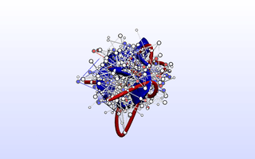
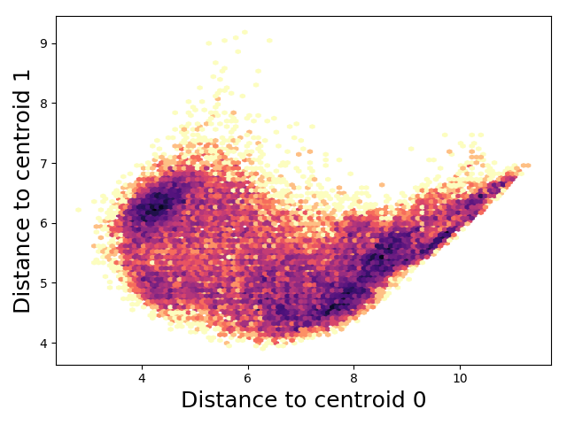

<figure class="figure">
    
    <figcaption class="figure-caption">
    What is this peptide doing? Read on to find out
    </figcaption>
</figure>

Deep learning has revolutionized image and speech processing, 
allowing you to turn [edges into cats](https://affinelayer.com/pixsrv/index.html).
In our lab, we're applying these techniques to 
small molecule [drug discovery](https://arxiv.org/abs/1611.03199).

A by-product of the revolution in deep learning has been the development of several
high-quality open-source machine-learning frameworks that can compute gradients
of arbitrary operations. Google's [Tensorflow](https://www.tensorflow.org/) may
be the best known. My research has focused on understanding the results of large
molecular dynamics simulations of proteins and other biomolecules.
You can easily imagine framing the prediction of small molecule binding energies as
a learning problem; can we leverage some of the deep learning advances for 
molecular dynamics for things in addition to [artsy protein images](https://twitter.com/mmsltn/status/759590171427745792)?

A common operation in biophysics is computing the similarity of two protein
poses (conformations) with the [RMSD distance metric](https://en.wikipedia.org/wiki/Root-mean-square_deviation_of_atomic_positions).
This metric is beloved for its respect of translational and rotational invariances.
Roughly, it overlays two protein structures and reports the mean distance between an atom and its
partner in the other structure.

## RMSD and rotations

Satisfying translational symmetry is easy: you just center your proteins at the
origin prior to doing a comparison

```python
# traj = np.array(...) [shape (n_frames, n_atoms, 3)]
traj -= np.mean(traj, axis=1, keepdims=True)
```

Satisfying rotational symmetry is harder. You need to find the optimal rotation
between each pair of conformations (optimal = minimizes the RMSD). Back in
1976, [Kabsch](https://doi.org/10.1107/S0567739476001873) figured out that 
you could do an SVD of the 3x3 (xyz) correlation matrix to find the optimal
rotation matrix.

```python
# x1 = np.array(...) [shape (n_atoms, 3)]
correlation_matrix = np.dot(x1.T, x2)
V, S, W_tr = np.linalg.svd(correlation_matrix)
rotation = np.dot(V, W_tr)
x1_rot = np.dot(x1, rotation)
```

This isn't ideal because the SVD might give you a "rotoinversion", aka 
impropper rotation, aka rotation followed by an inversion. We have
to explicitly check for and fix this case:

```python
correlation_matrix = np.dot(x1.T, x2)
V, S, W_tr = np.linalg.svd(correlation_matrix)
is_reflection = (np.linalg.det(V) * np.linalg.det(W_tr)) < 0.0
if is_reflection:
    V[:, -1] = -V[:, -1]
rotation = np.dot(V, W_tr)
x1_rot = np.dot(x1, rotation)
```

### Quaternions to the rescue

In 1987, [Horn](https://dx.doi.org/10.1364/JOSAA.4.000629) figured out that
you can construct a 4x4 "key" matrix from combinations of elements of the correlation matrix.
He derived this matrix from quaternion math (although the key matrix is a normal
matrix). The leading eigenvalue of this matrix can be used to "rotationally correct"
the naive squared difference between atomic coordinates.

```python
correlation_matrix = np.dot(x1.T, x2)
F = key_matrix(correlation_matrix)
vals, vecs = np.linalg.eigh(F)
max_val = vals[-1] # numpy sorts ascending
sd = np.sum(traj1 ** 2 + traj2 ** 2) - 2 * max_val
msd = sd / n_atoms
rmsd = np.sqrt(msd)
```

Crucially, you don't need to explicitly construct a rotation matrix
to find the RMSD value. If you want the rotation, you can reconstruct it
from the leading eigen*vector* of the key matrix.

## Tensorflow can do this

We've formulated the problem as vector operations and one
self-adjoint eigenvalue problem. All of these operations are implemented in
Tensorflow!

```python
def key_matrix(r):
    # @formatter:off
    return [
        [r[0][0] + r[1][1] + r[2][2], r[1][2] - r[2][1], r[2][0] - r[0][2], r[0][1] - r[1][0]],
        [r[1][2] - r[2][1], r[0][0] - r[1][1] - r[2][2], r[0][1] + r[1][0], r[0][2] + r[2][0]],
        [r[2][0] - r[0][2], r[0][1] + r[1][0], -r[0][0] + r[1][1] - r[2][2], r[1][2] + r[2][1]],
        [r[0][1] - r[1][0], r[0][2] + r[2][0], r[1][2] + r[2][1], -r[0][0] - r[1][1] + r[2][2]],
    ]


def squared_deviation(frame, target):
    R = tf.matmul(frame, target, transpose_a=True)
    R_parts = [tf.unstack(t) for t in tf.unstack(R)]
    F_parts = key_matrix(R_parts)
    F = tf.stack(F_parts, name='F')
    vals, vecs = tf.self_adjoint_eig(F, name='eig')
    lmax = tf.unstack(vals)[-1] # tensorflow sorts ascending
    sd = tf.reduce_sum(frame ** 2 + target ** 2) - 2 * lmax
```

The benefit is now we get derivatives for free, so we can do interesting things.
As a toy example, this shows finding a "consensus" structure that minimizes
average RMSD to every frame in a molecular dynamics trajectory

<figure class="figure">
    
    <figcaption class="figure-caption">
    Now we have automatic derivatives of RMSD w.r.t. atomic coordinates.
    This gif shows the optimization of a set of initially randomly positioned
    atoms to minimize the average RMSD to every frame in a trajectory of the 
    <a href="https://figshare.com/articles/Fs_MD_Trajectories/1030363">
    Fs peptide</a>
    </figcaption>
</figure>

This is the normal, tensorflow code used to perform the optimization.

```python
target = tf.Variable(tf.truncated_normal((1, n_atoms, 3), stddev=0.3), name='target')
msd, rot = pairwise_msd(traj, target)
loss = tf.reduce_mean(msd, axis=0)

optimizer = tf.train.AdamOptimizer(1e-3)
train = optimizer.minimize(loss)

sess = tf.Session()
sess.run(tf.global_variables_initializer())
for step in range(2500):
    sess.run(train)
```

## Tensorflow can't actually do this very well

Doing an eigendecomposition for each data point gets expensive, especially
since I want to be able to do pairwise (R)MSD calculations between a large
trajectory and a sizeable number of target structures. [MDTraj](http://mdtraj.org/) 
can perform a huge number of RMSD calculations exceedingly quickly. It uses
a better strategy for finding the leading eigenvalue of the 4x4 key matrix
from above. The [Theobald QCP](http://theobald.brandeis.edu/qcp/) method from 2005
explicitly writes out the characteristic polynomial for the key matrix. We
use the fact that there is a bound for identical structures ((R)MSD = 0) to choose
a starting point for an iterative, Newton method of finding the leading eigenvalue.
If we start from this point, we're guarenteed that the first root of the characteristic
polynomial will be the largest eigenvalue. So let's code this up in Tensorflow! Not
so fast (literally): you can't really do iteration in Tensorflow, and who knows
how performant it would be if you could.

### Custom Pairwise MSD Op

Instead, I implemented a [custom Tensorflow "op"](https://www.tensorflow.org/extend/adding_an_op).
At first, I was intimidated by having to build and keep track of a custom 
Tensorflow installation. Luckily, Tensorflow will happily load shared libraries
to register Ops at runtime. Even better, a Pande Group Alumn Imran Haque 
[implemented](https://github.com/pandegroup/IRMSD) 
a fast (R)MSD calculation implementation in C that I could wrap.

I implemented an Op that does pairwise MSD calculations where the double-for-loop
is parallelized with OpenMP. In addition to the 10,000x speedup from the native 
tensorflow implementation of the Horn method, we're slightly faster than MDTraj 
even though it's using the same implementation under the hood. For MDTraj, the
looping over a trajectory is done with OpenMP in C, but the iteration over targets
has to be done in Python with its associated overhead.

I ran a benchmark which performs a pairwise RMSD calculation among 
[fs peptide](https://figshare.com/articles/Fs_MD_Trajectories/1030363)
trajectories. Specifically, between 2800 (stride = 100) frames and 28 targets
(stride = 100 * 100).


Implementation | Time / ms
----------|----------
TF Native Ops | 22,843
MDTraj    |   33.3
TF Custom Op   |    0.9
TF Custom Op (w/rot)   |    1.6
{: .table}

## What about gradients?

The reason why we wanted to use Tensorflow in the first place was to do fun
things with the automatic differentiation. There's no free lunch, and Tensorflow
will not auto-differentiate our custom Op. [Coutsias et. al.](https://dx.doi.org/10.1002/jcc.20110)
pointed out that the derivative of the MSD is simply the difference between the
coordinates in the superposed pair of structures. We can code this.

The first problem is now we need the rotation matrix explicitly so we can
use it to compute the gradients. Remember that Theobald came up with a smart
method for finding the leading eigenvalue, but that only gives us the RMSD value, 
not the actual rotation (which requires the eigenvector). Luckily, in 2010 he
extended the method to use the leading eigenvalue to quickly find the 
leading eigenvector.

I modified the `pairwise_msd` op to return a (n_frames, n_targets) 
pairwise MSD matrix *and* the (n_frames, n_targets, 3, 3) rotation matrices.
Users should never use the rotation matrices for further calculations because
I didn't implement the derivatives for that output. Instead, I use that output
in the gradient calculation for the MSDs. If someone knows a better way to do this,
please let me know.

In the benchmark table, this version of the Op is the "w/rot" variant, and is
slower (because it has to do more work).

### Way too much detail about the gradient code

Most of this code is just making tensors the right shape. We need to apply 
our n_frames * n_targets rotation matrices individually to each conformation, and
we need to mix in the gradient `grad` from the previous Op in the compute graph,
so we blow everything up to a rank 4 matrix and *explicitly tile* the conformations
to be rotated because `matmul` doesn't do broadcasting.

```python
rots = op.outputs[1]
N1 = int(confs1.get_shape()[0])
N2 = int(confs2.get_shape()[0])

# expand from (n_frames, n_targets) to (n_frame, n_targets, 1, 1) 
grad = tf.expand_dims(tf.expand_dims(grad, axis=-1), axis=-1)

# expand from (n_frames OR n_targets, n_atoms, 3) 
# to (n_frames OR 1, 1 OR n_targets, n_atoms, 3)
expand_confs1 = tf.expand_dims(confs1, axis=1)
expand_confs2 = tf.expand_dims(confs2, axis=0)

# Explicitly tile conformations for matmul
big_confs1 = tf.tile(expand_confs1, [1, N2, 1, 1])
big_confs2 = tf.tile(expand_confs2, [N1, 1, 1, 1])

# This is the gradient!
dxy = expand_confs1 - tf.matmul(big_confs2, rots, transpose_b=True)
dyx = expand_confs2 - tf.matmul(big_confs1, rots, transpose_b=False)
```

The actual form of the gradient has a couple factors which we must include:

```python
n_atom = float(int(confs1.get_shape()[1]))
dxy = 2 * dxy / n_atom
dyx = 2 * dyx / n_atom
```

Finally, we sum over the axis that has the *other* conformations to
make sure our gradient tensors match in shape to their variables.

```python
dr_dc1 = tf.reduce_sum(grad * dxy, axis=1)
dr_dc2 = tf.reduce_sum(grad * dyx, axis=0)
```

Did you forget about translational symmetry after all this focus on rotation?
I did originally! Test your code on a variety of inputs *including* trajectories
that aren't pre-centered :). Let's use Tensorflow's automatic differentiation
for this part.

Specifically, we set up the "forward" op and call `tf.gradients` on it. We pass
in our gradients w.r.t. rotation as the `grad_ys` argument. Yay chain rule!

```python
centered1 = confs1 - tf.reduce_mean(confs1, axis=1, keep_dims=True)
centered2 = confs2 - tf.reduce_mean(confs2, axis=1, keep_dims=True)
dc_dx1 = tf.gradients(centered1, [confs1], grad_ys=dr_dc1)[0]
dc_dx2 = tf.gradients(centered2, [confs2], grad_ys=dr_dc2)[0]
```

## KMeans-inspired RMSD clustering

As an example of what we can do with our fast pairwise MSD op with 
gradients, let's find "optimal" cluter centers (centroids). For a 
trajectory of conformations, find centers that minimize
the distance between each point and its closest centroid.
To prevent it from finding the same centroid twice, we add a penalty
to force the centroids apart. Be careful to make sure this penalty
saturates at some point or your optimization will just make really different
centroids with no respect for inter-cluster distances.

```python
# Out inputs
n_clusters = 2
target = tf.Variable(tf.truncated_normal((n_clusters, traj.xyz.shape[1], 3), stddev=0.3))

# Set up the compute graph
msd, rot = rmsd_op.pairwise_msd(traj.xyz, target)
nearest_cluster = msd * tf.nn.softmax(-msd)
cluster_dist = tf.reduce_mean(nearest_cluster, axis=(0, 1))
cluster_diff, _ = rmsd_op.pairwise_msd(target, target)
cluster_diff = cluster_diff[0, 1]
loss = cluster_dist - tf.tanh(cluster_diff*10)

# Train it in the normal way
optimizer = tf.train.AdamOptimizer(5e-3)
train = optimizer.minimize(loss)

sess = tf.Session()
sess.run(tf.global_variables_initializer())
for step in range(1000):
    sess.run(train)
```

<figure class="figure">
    
    <figcaption class="figure-caption">
    This shows the optimization of two cluster centroids over time. The
    optimization has decided that it can minimize intercluster distances
    by learning an extended-looking conformation and a compressed-looking
    one.
    </figcaption>
</figure>

Now you can do tICA or [make an MSM](http://msmbuilder.org) in this nice space.

<figure class="figure">
    
    <figcaption class="figure-caption">
    In addition to being able to histogram / plot, there's no limit
    to the things you can do now that you're in a Euclidean vector
    space rather than having to deal with RMSDs. For example,
    you can do tICA or PCA now.
    </figcaption>
</figure>

## Code Availability

All code is available on [Github](https://github.com/mdtraj/tftraj). 
Make sure you check out the [README](https://github.com/mdtraj/tftraj/blob/master/README.md) 
for installation instructions, as the custom Op requires a working c++ compiler.
The consensus example, clustering example, and profiling script are found in 
the [examples](https://github.com/mdtraj/tftraj/tree/master/examples) 
folder and require the
[fs peptide](https://figshare.com/articles/Fs_MD_Trajectories/1030363)
dataset.

The native tensorflow implementation lives in [rmsd.py](https://github.com/mdtraj/tftraj/blob/master/tftraj/rmsd.py).
The low level code for the custom Op lives in the
[rmsd/](https://github.com/mdtraj/tftraj/tree/master/tftraj/rmsd)
subfolder, specifically [rmsd.cpp](https://github.com/mdtraj/tftraj/blob/master/tftraj/rmsd/rmsd.cpp).
Finally, [rmsd_op.py](https://github.com/mdtraj/tftraj/blob/master/tftraj/rmsd_op.py)
contains a convenience function for loading the shared object
that registers the Op. It also implements the gradients (in Python).
